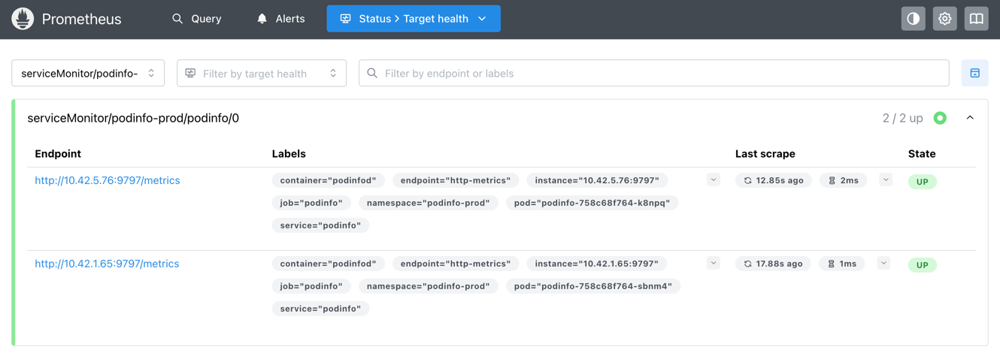
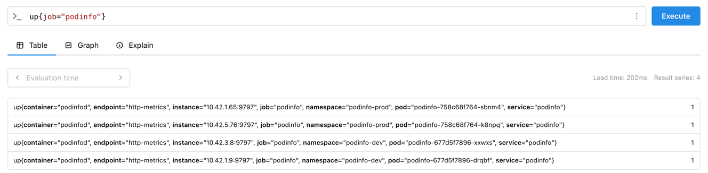
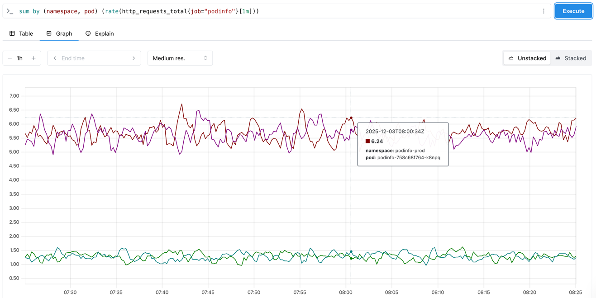

# Lab: Prometheus Operator

[Task Description](https://talks.timebertt.dev/platform-engineering/#/lab-prometheus-operator)

## Explore the `Prometheus` Custom Resource

With the [previous labs](kube-prometheus-stack.md), we have installed the kube-prometheus-stack Helm chart, which includes a `Prometheus` custom resource.

```bash
$ kubectl -n monitoring get prometheus
NAME                               VERSION   DESIRED   READY   RECONCILED   AVAILABLE   AGE
kube-prometheus-stack-prometheus   v3.7.3    1         1       True         True        8d
```

The status of the `Prometheus` resource shows that one instance is deployed and ready.
The Prometheus instance is managed by a `StatefulSet` resulting in one `Pod` and corresponding `PersistentVolumeClaim`.

```bash
$ kubectl -n monitoring get sts,pod,pvc -l prometheus
NAME                                                           READY   AGE
statefulset.apps/prometheus-kube-prometheus-stack-prometheus   1/1     8d

NAME                                                READY   STATUS    RESTARTS   AGE
pod/prometheus-kube-prometheus-stack-prometheus-0   2/2     Running   0          8d

NAME                                                                                                                 STATUS   VOLUME                                     CAPACITY   ACCESS MODES   STORAGECLASS   VOLUMEATTRIBUTESCLASS   AGE
persistentvolumeclaim/prometheus-kube-prometheus-stack-prometheus-db-prometheus-kube-prometheus-stack-prometheus-0   Bound    pvc-973322d7-efb8-4f89-9e21-edd387a61367   20Gi       RWO            local-path     <unset>                 8d
```

We can determine the `ServiceMonitor` selector used by the Prometheus instance by inspecting the `Prometheus` resource:

```bash
$ kubectl -n monitoring get prometheus kube-prometheus-stack-prometheus -o yaml
apiVersion: monitoring.coreos.com/v1
kind: Prometheus
metadata:
  name: kube-prometheus-stack-prometheus
  namespace: monitoring
spec:
  serviceMonitorSelector:
    matchLabels:
      release: kube-prometheus-stack
  # ...
```

We make note of the `serviceMonitorSelector` section, which configures Prometheus to scrape targets defined by `ServiceMonitor` resources with the label `release=kube-prometheus-stack` (in all namespaces).

## Set Up a `ServiceMonitor`

We add a `ServiceMonitor` manifest to configure Prometheus to scrape metrics from the `podinfo` application: [`deploy/podinfo/base/servicemonitor.yaml`](../deploy/podinfo/base/servicemonitor.yaml).
We add labels to the `ServiceMonitor` so that it matches the `serviceMonitorSelector` of the Prometheus instance.

```yaml
apiVersion: monitoring.coreos.com/v1
kind: ServiceMonitor
metadata:
  name: podinfo
  labels:
    # must match the .spec.serviceMonitorSelector in the Prometheus custom resource
    release: kube-prometheus-stack
spec:
  endpoints:
  # must match the port name in the Service
  - port: http-metrics
    path: /metrics
    interval: 10s
  selector:
    matchLabels:
      # must match the labels of the Service
      app: podinfo
```

To ensure the `ServiceMonitor.spec.selector` matches the `podinfo` Service, we add the corresponding label to the Service using a Kustomize `labels` transformer: [`deploy/podinfo/base/kustomization.yaml`](../deploy/podinfo/base/kustomization.yaml).

```yaml
apiVersion: kustomize.config.k8s.io/v1beta1
kind: Kustomization

resources:
# other resources ...
- servicemonitor.yaml

# add common labels to all resources
# the ServiceMonitor selects the podinfo Service via labels, so it requires the labels to be present on the Service
labels:
- pairs:
    app: podinfo
```

Lastly, we need to ensure that the `podinfo` Service exposes the metrics endpoint on a named port `http-metrics` as configured in `ServiceMonitor.spec.endpoints[0].port`.
We add the corresponding port to the Service using a Kustomize `patch`: [`deploy/podinfo/base/kustomization.yaml`](../deploy/podinfo/base/kustomization.yaml).

```yaml
apiVersion: kustomize.config.k8s.io/v1beta1
kind: Kustomization

patches:
# extend the Service ports list
- target:
    kind: Service
    name: podinfo
  patch: |-
    - op: add
      path: /spec/ports/-
      value: 
        # in the remote base manifests, the http-metrics port is only defined in the Deployment but not in the Service
        # add the http-metrics port to be scraped by Prometheus (via ServiceMonitor)
        name: http-metrics
        port: 9797
        protocol: TCP
        targetPort: http-metrics
```

## Verify the Scrape Configuration

After completing the above steps and pushing the changes to GitHub, Flux should deploy the `ServiceMonitor` and the Prometheus Operator should automatically update our Prometheus instance's scrape configuration to scrape the `podinfo` application.

In the [previous labs](kube-prometheus-stack.md), we configured an ingress resource to access the Prometheus web UI.
Determine the URL to access the Prometheus web UI by checking the ingress resource in the `monitoring` namespace and open it in your web browser.

```bash
$ kubectl -n monitoring get ing
NAME                               CLASS   HOSTS                                             ADDRESS                                        PORTS     AGE
kube-prometheus-stack-grafana      nginx   grafana.<cluster-name>.dski23a.timebertt.dev      141.72.176.127,141.72.176.195,141.72.176.219   80, 443   8d
kube-prometheus-stack-prometheus   nginx   prometheus.<cluster-name>.dski23a.timebertt.dev   141.72.176.127,141.72.176.195,141.72.176.219   80, 443   8d
```

In the Prometheus web UI, navigate to the "Status > Configuration" page and verify that new `scrape_config` sections have been added for the `podinfo` `ServiceMonitor` resources in the `podinfo-dev` and `podinfo-prod` namespaces.

```yaml
scrape_configs:
# ...
- job_name: serviceMonitor/podinfo-dev/podinfo/0
  # ...
- job_name: serviceMonitor/podinfo-prod/podinfo/0
  # ...
```

The "Status > Service discovery" page should also show the `podinfo` scrape pools and the discovered endpoints for the `podinfo` application in both namespaces.

Based on this, the "Status > Target health" page should show healthy targets for the `podinfo` application in both namespaces.



As a final verification step, we can query the `up` metric for the `podinfo` job to confirm that Prometheus is successfully scraping metrics from the application.

```text
up{job="podinfo"}
```



## Query the Application's Request Rate

To explore all metrics exposed by the `podinfo` application, we can use the following query.
The result shows a list of metric names exposed by the application.

```text
count by (__name__) ({job="podinfo"})
```

In the metrics list, we can find the `http_requests_total` metric (see [podinfo metrics definition](https://github.com/stefanprodan/podinfo/blob/0f360bb788c8e1965e02eb7e76b22579edeced02/pkg/api/http/metrics.go#L32-L39)).
It is a counter metric that tracks the total number of HTTP requests received by the application, labeled by `status` (HTTP status code).

We can calculate the request rate for the application using the `rate` function in PromQL.
To calculate the request rate across all status codes per instance (pod), we can aggregate the results using the `sum` operator and group by the `namespace` and `pod` labels:

```text
sum by (namespace, pod) (rate(http_requests_total{job="podinfo"}[1m]))
```

## Add a Load Generator

To see the request rate metric in action, we add a simple load generator that continuously sends HTTP requests to the `podinfo` application.
The load generator is implemented as a Kubernetes `Deployment` using a lightweight `curl` container image that sends requests in an infinite loop: [`deploy/podinfo/base/load-generator.yaml`](../deploy/podinfo/base/load-generator.yaml).

```yaml
apiVersion: apps/v1
kind: Deployment
metadata:
  name: load-generator
spec:
  # ...
  template:
    spec:
      containers:
      - name: load-generator
        image: alpine/curl
        command: ["/bin/sh", "-c"]
        args:
          - |
            while true; do
              date -Is
              curl -sSo /dev/null http://podinfo:$PODINFO_SERVICE_PORT_HTTP/
              # wait a random time between 0.1s and 0.9s
              sleep 0.$(( $RANDOM % 10 ))
            done
```

After pushing the changes to GitHub, Flux should deploy the load generator to both the `podinfo-dev` and `podinfo-prod` namespaces.
We can increase the generated load by scaling the `load-generator` Deployment to multiple replicas.

```bash
$ kubectl -n podinfo-prod scale deploy load-generator --replicas 5
$ kubectl -n podinfo-prod get po
NAME                              READY   STATUS    RESTARTS   AGE
load-generator-5476755ddd-7z479   1/1     Running   0          9h
load-generator-5476755ddd-8clrl   1/1     Running   0          9h
load-generator-5476755ddd-m57pb   1/1     Running   0          9h
load-generator-5476755ddd-p4xbh   1/1     Running   0          9h
load-generator-5476755ddd-qw2gc   1/1     Running   0          9h
podinfo-758c68f764-k8npq          1/1     Running   0          2d16h
podinfo-758c68f764-sbnm4          1/1     Running   0          2d16h
```

With the load generator running, we can revisit the Prometheus web UI and re-execute the request rate query to see the updated metrics reflecting the generated load.


